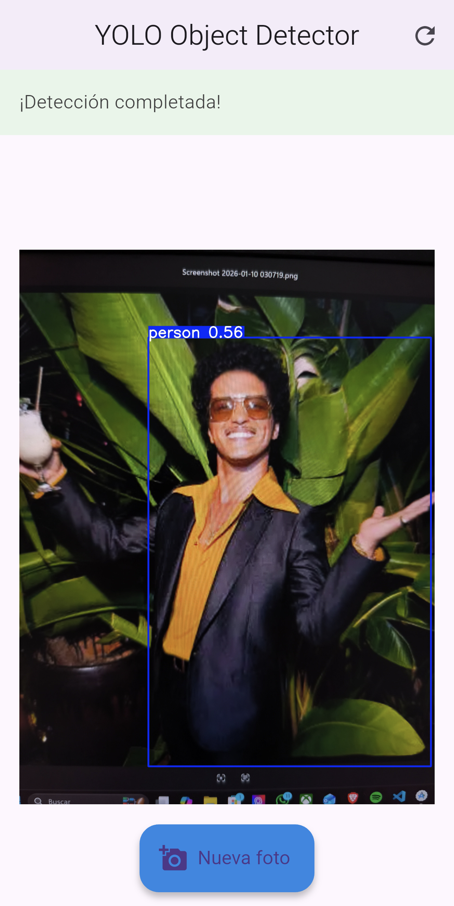

# 📱 YOLO Object Detector - Mobile App

Flutter mobile application for real-time object detection using YOLO11n. Compatible with Android, Windows, Linux and Web.

---

## 📋 Features

- 📸 **Camera Capture** - Take photos directly from the app
- 🖼️ **Gallery Selection** - Choose existing images
- ⚡ **Real-time Detection** - Live updates via Firestore
- 🎨 **Annotated Results** - Visual bounding boxes
- 📊 **Detection Details** - Class names and confidence scores
- 🔄 **Retry Logic** - Automatic timeout handling
- 🔐 **Anonymous Auth** - No login required

---


## 📸 Demo

<p align="center">
    
</p>

---

## 🛠️ Prerequisites

- **Flutter SDK** 3.0 or higher
- **Dart** 3.0+
- **Android Studio** (for device deployment)
- **Firebase Project** configured

---

## 🚀 Setup

### 1. Install Flutter

Download from ``https://docs.flutter.dev/get-started/install``

### 2. Configure Firebase

#### a. Create Firebase Project

1. Go to [Firebase Console](https://console.firebase.google.com/)
2. Create a new project (or use existing)
3. Enable **Firestore**, **Storage**, and **Authentication**

#### b. Add Firebase to Flutter

**For Android:**

1. Download `google-services.json` from Firebase Console
2. Place in `android/app/`

#### c. Generate Firebase Options

```bash
# Install FlutterFire CLI
dart pub global activate flutterfire_cli

# Configure Firebase
flutterfire configure
```

This creates `lib/firebase_options.dart` automatically.

### 3. Install Dependencies

```bash
flutter pub get
```

### 4. Run the App

```bash
# Check connected devices
flutter devices

# Run on connected device
flutter run

# Or specify platform
flutter run -d chrome      # Web
flutter run -d macos       # macOS
flutter run -d android     # Android
```

---

## 📁 Project Structure

```text
mobile/
├── lib/
│   ├── services/
│   │   └── firebase_services.dart    # Firebase operations
│   ├── main.dart                     # App entry point
│   └── detector_screen.dart          # Main detection UI
│    
├── android/
│   └── app/
│       └── google-services.json      # Firebase config (add this)
│
├── ios/
│   └── Runner/
│       └── GoogleService-Info.plist  # Firebase config (add this)
│
├── pubspec.yaml                      # Dependencies
└── README.md                         # This file
```

---

## 🔧 Key Files

### `main.dart`

- Initializes Firebase
- Sets up anonymous authentication
- Defines app theme

### `detector_screen.dart`

- Main UI and user interactions
- Image capture/selection
- Result display
- Error handling

### `firebase_service.dart`

- Upload images to Storage
- Listen to Firestore updates
- Get processed image URLs
- Handle cleanup

---

## 🎨 UI Flow

1. **Initial Screen**
   - Empty state with instruction
   - FAB button to select image

2. **Image Selection**
   - Bottom sheet with 2 options:
     - 📷 Take photo
     - 🖼️ Choose from gallery

3. **Processing**
   - Shows selected image
   - Status bar: "Uploading image..."
   - Status bar: "Processing with YOLO..."
   - Loading indicator

4. **Results**
   - Shows annotated image with bounding boxes
   - Detection count
   - Refresh button to start over

5. **Error Handling**
   - Timeout after 60 seconds
   - Connection errors
   - Upload failures
   - Red snackbar with error message

---

## 🔐 Firebase Security

The app uses **anonymous authentication** by default. Users don't need to create accounts.

```dart
// In main.dart
await FirebaseAuth.instance.signInAnonymously();
```

### Firestore Rules (configured in backend)

```javascript
match /detection_results/{docId} {
  allow read: if true;
  allow write: if false;
}
```

### Storage Rules (configured in backend)

```javascript
match /uploads/{allPaths=**} {
  allow read, write: if true;
}

match /results/{allPaths=**} {
  allow read: if true;
  allow write: if false;
}
```

---

## 📱 Platform-Specific Configuration

### Android

**Minimum SDK Version**: 21 (Android 5.0)

`android/app/build.gradle`:

```gradle
android {
  ndkVersion = "27.0.12077973"
}
```

**Permissions**:

```xml
<uses-permission android:name="android.permission.INTERNET"/>
<uses-permission android:name="android.permission.CAMERA"/>
<uses-permission android:name="android.permission.READ_EXTERNAL_STORAGE"/>
```

---

## 🐛 Troubleshooting

### Issue: Firebase not initialized

**Solution:**

```bash
flutterfire configure
```

### Issue: Image picker not working

**Solution:** Check camera/gallery permissions in device settings

### Issue: No detection results

**Solutions:**

1. Check Firebase Console → Functions logs
2. Verify Cloud Run is deployed
3. Check Firestore for errors in document
4. Increase timeout in `detector_screen.dart`

---

## 🚀 Building for Production

### Android APK

```bash
flutter build apk --release
# Output: build/app/outputs/flutter-apk/app-release.apk
```

### Android App Bundle (for Play Store)

```bash
flutter build appbundle --release
# Output: build/app/outputs/bundle/release/app-release.aab
```

---

## 🔄 Update Flow

1. User selects/captures image
2. Image uploaded to `uploads/{timestamp}.jpg`
3. Firebase Storage triggers Cloud Function
4. Cloud Function processes with YOLO
5. Annotated image saved to `results/{timestamp}.jpg`
6. Firestore document updated with results
7. Flutter listens to Firestore and shows result

---

## 📊 Performance Tips

1. **Image Quality**: Set `imageQuality: 85` to balance quality and size
2. **Timeout**: Adjust timeout based on network conditions
3. **Caching**: Images are cached by default
4. **Memory**: Large images are automatically compressed

---

## 🔗 Useful Links

- [Flutter Documentation](https://docs.flutter.dev/)
- [Firebase for Flutter](https://firebase.flutter.dev/)
- [Image Picker Plugin](https://pub.dev/packages/image_picker)
- [Flutter Best Practices](https://docs.flutter.dev/perf/best-practices)

---

## 🤝 Contributing

If you'd like to contribute to this project, feel free to submit a pull request. Please make sure your code follows the existing style and includes appropriate comments.

1. Fork the repository.
2. Create a new branch for your feature or bug fix.
3. Commit your changes.
4. Push to the branch.
5. Submit a pull request.

## 👤 Author

````Carlos Antonio Martinez Miranda````

GitHub: [@CarlosM1024](https://github.com/CarlosM1024)

Made with Flutter 💙
